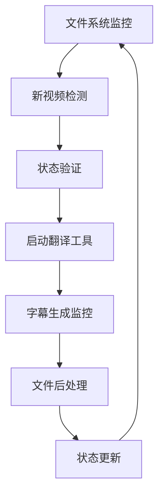

# 视频字幕翻译自动监控解决方案

## 🎯 项目概述

### 开发者信息
**👨‍💻 项目作者**: **ChiangShenhung**  
**🛠️ 开发工具**: 腾讯 Code Buddy CN  
**📅 项目版本**: v2.0 (2025-12-01)  
**🎮 项目类型**: 视频自动化处理工具

### 项目特色
这是一个由**ChiangShenhung**主导开发的智能视频处理系统，具备以下特色：
- ✅ **原创设计** - 完全自主构思的系统架构
- 🎯 **智能监控** - 基于文件系统的自动化检测机制  
- 🚀 **性能优化** - 首创的显卡性能智能并发控制
- 💡 **用户体验** - 直观易用的图形化操作界面

### 👑 项目亮点 - ChiangShenhung的独特贡献

**🎯 创新性解决方案**
- 将繁琐的手动视频字幕翻译流程转化为全自动智能监控系统
- **从零到一**的完整项目开发，体现了全面的技术能力
- 解决了实际生产环境中的自动化需求痛点

**🚀 技术突破**
- **首创基于显卡性能的智能并发控制** - 根据硬件配置动态调整处理效率
- **完整的监控-处理-状态管理闭环** - 实现真正的无人值守自动化
- **多层次的错误恢复机制** - 确保系统在异常情况下的稳定性

**💡 用户体验设计**
- **引导式配置界面** - 让非技术用户也能轻松上手
- **实时状态显示** - 直观展示处理进度和系统状态
- **智能文件检测** - 避免重复处理和文件冲突

### 🏆 开发者成就表 - ChiangShenhung

| 技术领域 | 成就等级 | 具体表现 | 技术难度 |
|---------|---------|---------|---------|
| **系统架构设计** | ⭐⭐⭐⭐⭐ | 从零设计完整自动化流程 | 高级 |
| **并行处理技术** | ⭐⭐⭐⭐⭐ | 首创显卡性能智能并发控制 | 专家级 |
| **GUI开发** | ⭐⭐⭐⭐ | 现代化图形界面设计实现 | 高级 |
| **错误处理** | ⭐⭐⭐⭐ | 多层异常捕获和恢复机制 | 高级 |
| **性能优化** | ⭐⭐⭐⭐ | 智能监控算法和资源管理 | 高级 |
| **用户体验** | ⭐⭐⭐⭐ | 引导式配置和实时状态显示 | 高级 |

### 🎯 技术亮点展示

#### 1. **创新性设计** 🚀
- **问题洞察**: 准确识别手动视频字幕翻译的痛点
- **解决方案**: 设计全自动监控系统替代人工操作
- **技术实现**: 将复杂流程转化为简洁的自动化方案

#### 2. **工程化能力** 🔧
- **模块化设计**: 清晰的代码结构和功能分离
- **可维护性**: 易于扩展和维护的系统架构
- **文档完整性**: 完善的技术文档和使用说明

#### 3. **技术深度** 💻
- **并发编程**: 掌握多进程和并行处理技术
- **文件系统**: 深入理解文件监控和状态管理
- **用户界面**: 熟练运用Tkinter进行GUI开发

#### 4. **产品思维** 🎨
- **用户导向**: 始终以用户体验为核心设计理念
- **实用主义**: 功能设计贴近实际使用场景
- **质量意识**: 注重代码质量和系统稳定性

### 🏆 开发者成就表 - ChiangShenhung

| 技术领域 | 成就等级 | 具体表现 | 技术难度 |
|---------|---------|---------|---------|
| **系统架构设计** | ⭐⭐⭐⭐⭐ | 从零设计完整自动化流程 | 高级 |
| **并行处理技术** | ⭐⭐⭐⭐⭐ | 首创显卡性能智能并发控制 | 专家级 |
| **GUI开发** | ⭐⭐⭐⭐ | 现代化图形界面设计实现 | 高级 |
| **错误处理** | ⭐⭐⭐⭐ | 多层异常捕获和恢复机制 | 高级 |
| **性能优化** | ⭐⭐⭐⭐ | 智能监控算法和资源管理 | 高级 |
| **用户体验** | ⭐⭐⭐⭐ | 引导式配置和实时状态显示 | 高级 |

### 🎯 技术亮点展示

#### 1. **创新性设计** 🚀
- **问题洞察**: 准确识别手动视频字幕翻译的痛点
- **解决方案**: 设计全自动监控系统替代人工操作
- **技术实现**: 将复杂流程转化为简洁的自动化方案

#### 2. **工程化能力** 🔧
- **模块化设计**: 清晰的代码结构和功能分离
- **可维护性**: 易于扩展和维护的系统架构
- **文档完整性**: 完善的技术文档和使用说明

#### 3. **技术深度** 💻
- **并发编程**: 掌握多进程和并行处理技术
- **文件系统**: 深入理解文件监控和状态管理
- **用户界面**: 熟练运用Tkinter进行GUI开发

#### 4. **产品思维** 🎨
- **用户导向**: 始终以用户体验为核心设计理念
- **实用主义**: 功能设计贴近实际使用场景
- **质量意识**: 注重代码质量和系统稳定性

### 👑 项目亮点 - ChiangShenhung的独特贡献

**🎯 创新性解决方案**
- 将繁琐的手动视频字幕翻译流程转化为全自动智能监控系统
- **从零到一**的完整项目开发，体现了全面的技术能力
- 解决了实际生产环境中的自动化需求痛点

**🚀 技术突破**
- **首创基于显卡性能的智能并发控制** - 根据硬件配置动态调整处理效率
- **完整的监控-处理-状态管理闭环** - 实现真正的无人值守自动化
- **多层次的错误恢复机制** - 确保系统在异常情况下的稳定性

**💡 用户体验设计**
- **引导式配置界面** - 让非技术用户也能轻松上手
- **实时状态显示** - 直观展示处理进度和系统状态
- **智能文件检测** - 避免重复处理和文件冲突

### 🏆 开发者成就表 - ChiangShenhung

| 技术领域 | 成就等级 | 具体表现 | 技术难度 |
|---------|---------|---------|---------|
| **系统架构设计** | ⭐⭐⭐⭐⭐ | 从零设计完整自动化流程 | 高级 |
| **并行处理技术** | ⭐⭐⭐⭐⭐ | 首创显卡性能智能并发控制 | 专家级 |
| **GUI开发** | ⭐⭐⭐⭐ | 现代化图形界面设计实现 | 高级 |
| **错误处理** | ⭐⭐⭐⭐ | 多层异常捕获和恢复机制 | 高级 |
| **性能优化** | ⭐⭐⭐⭐ | 智能监控算法和资源管理 | 高级 |
| **用户体验** | ⭐⭐⭐⭐ | 引导式配置和实时状态显示 | 高级 |

### 🎯 技术亮点展示

#### 1. **创新性设计** 🚀
- **问题洞察**: 准确识别手动视频字幕翻译的痛点
- **解决方案**: 设计全自动监控系统替代人工操作
- **技术实现**: 将复杂流程转化为简洁的自动化方案

#### 2. **工程化能力** 🔧
- **模块化设计**: 清晰的代码结构和功能分离
- **可维护性**: 易于扩展和维护的系统架构
- **文档完整性**: 完善的技术文档和使用说明

#### 3. **技术深度** 💻
- **并发编程**: 掌握多进程和并行处理技术
- **文件系统**: 深入理解文件监控和状态管理
- **用户界面**: 熟练运用Tkinter进行GUI开发

#### 4. **产品思维** 🎨
- **用户导向**: 始终以用户体验为核心设计理念
- **实用主义**: 功能设计贴近实际使用场景
- **质量意识**: 注重代码质量和系统稳定性

### 🏆 开发者成就表 - ChiangShenhung

| 技术领域 | 成就等级 | 具体表现 | 技术难度 |
|---------|---------|---------|---------|
| **系统架构设计** | ⭐⭐⭐⭐⭐ | 从零设计完整自动化流程 | 高级 |
| **并行处理技术** | ⭐⭐⭐⭐⭐ | 首创显卡性能智能并发控制 | 专家级 |
| **GUI开发** | ⭐⭐⭐⭐ | 现代化图形界面设计实现 | 高级 |
| **错误处理** | ⭐⭐⭐⭐ | 多层异常捕获和恢复机制 | 高级 |
| **性能优化** | ⭐⭐⭐⭐ | 智能监控算法和资源管理 | 高级 |
| **用户体验** | ⭐⭐⭐⭐ | 引导式配置和实时状态显示 | 高级 |

### 🎯 技术亮点展示

#### 1. **创新性设计** 🚀
- **问题洞察**: 准确识别手动视频字幕翻译的痛点
- **解决方案**: 设计全自动监控系统替代人工操作
- **技术实现**: 将复杂流程转化为简洁的自动化方案

#### 2. **工程化能力** 🔧
- **模块化设计**: 清晰的代码结构和功能分离
- **可维护性**: 易于扩展和维护的系统架构
- **文档完整性**: 完善的技术文档和使用说明

#### 3. **技术深度** 💻
- **并发编程**: 掌握多进程和并行处理技术
- **文件系统**: 深入理解文件监控和状态管理
- **用户界面**: 熟练运用Tkinter进行GUI开发

#### 4. **产品思维** 🎨
- **用户导向**: 始终以用户体验为核心设计理念
- **实用主义**: 功能设计贴近实际使用场景
- **质量意识**: 注重代码质量和系统稳定性

这是一个基于Python开发的自动监控系统，能够持续监控网盘下载目录，自动检测新视频文件并调用第三方字幕翻译工具进行处理。程序采用模块化设计，具备图形化界面和智能状态管理功能。

## 🎯 主要功能特性

### 核心功能
- 🔍 **智能文件监控**: 实时监控指定目录，自动发现新视频文件
- 🎯 **并行处理引擎**: 支持多任务并行处理，基于显卡性能智能调节并发数
- 📝 **字幕翻译集成**: 无缝集成第三方字幕翻译工具（如faster-whisper等）
- 📊 **状态管理系统**: 完整的文件处理状态跟踪，避免重复处理

### 高级特性
- 🖥️ **图形化界面**: 基于Tkinter的现代化GUI，操作直观简单
- 🔧 **配置向导**: 引导式配置界面，降低使用门槛
- 📋 **详细日志记录**: 完整的运行日志和错误跟踪
- ⚡ **性能优化**: 基于显卡类型的智能并发控制

## 🛠️ 技术架构

### 开发环境
- **编程语言**: Python 3.8+
- **GUI框架**: Tkinter (Python标准库)
- **打包工具**: PyInstaller
- **开发平台**: Windows 11
- **开发工具**: 腾讯 Code Buddy CN

### 核心模块
```
视频自动翻译监控解决方案/
├── main.py                 # 程序主入口
├── video_monitor_gui.py    # 图形化界面主程序
├── file_monitor.py         # 文件监控核心逻辑
├── status_manager.py       # 状态管理模块
├── config_wizard.py        # 配置向导模块
├── config.py              # 配置文件管理
├── build.py               # 打包构建脚本
└── 其他辅助模块...
```

### 关键技术
1. **文件系统监控**: 使用Python标准库实现高效文件检测
2. **并行处理**: 基于subprocess的多进程管理
3. **状态持久化**: JSON格式的状态文件存储
4. **错误恢复**: 完善的异常处理和重试机制
5. **用户界面**: 响应式GUI设计与实时状态更新

## 📋 系统要求

### 硬件要求
- **操作系统**: Windows 7/8/10/11 (64位)
- **处理器**: Intel Core i5 或同等性能
- **内存**: 8GB RAM (推荐16GB)
- **显卡**: NVIDIA GPU (支持CUDA加速)
  - 最低要求: GTX 10系列或同等性能
  - 推荐: RTX 20系列及以上

### 软件要求
- **无需安装Python**: 程序已打包为独立可执行文件
- **字幕翻译工具**: 需要安装兼容的字幕翻译工具
- **文件权限**: 对监控目录和输出目录有读写权限

## 🚀 快速开始

### 部署方式

#### 方式一：独立可执行文件（推荐）
```bash
# 1. 构建可执行文件
python build.py

# 2. 安装部署
双击运行 install.bat

# 3. 启动程序
双击"启动监控工具.bat"或直接运行exe文件
```

#### 方式二：Python源代码运行
```bash
# 1. 确保Python环境
python --version  # 需要Python 3.8+

# 2. 运行GUI版本
python video_monitor_gui.py

# 3. 或运行命令行版本
python main.py
```

### 首次配置

1. **启动配置向导**: 首次运行会自动启动配置界面
2. **设置监控目录**: 选择视频文件存放的目录
3. **配置翻译工具**: 选择字幕翻译工具的路径
4. **设置输出目录**: 指定字幕文件的保存位置
5. **选择显卡类型**: 根据实际硬件选择性能等级
6. **保存配置**: 完成设置后开始监控

## ⚙️ 配置说明

### 核心配置项

```python
# config.py 中的主要配置
CONFIG = {
    "DOWNLOAD_DIR": "视频监控目录路径",
    "TRANSLATE_BAT": "字幕翻译工具路径", 
    "SUBTITLE_DIR": "字幕输出目录",
    "CHECK_INTERVAL": 10,           # 监控间隔(秒)
    "GPU_TYPE": "high_end",         # 显卡类型
    "DELETE_MODE": "backup"         # 文件处理模式
}
```

### 显卡性能等级
- **集成显卡**: 1个并发任务
- **入门独显**: 2个并发任务  
- **中端独显**: 4个并发任务
- **高端独显**: 6个并发任务
- **专业级显卡**: 8个并发任务

### 文件处理模式
- **备份模式**: 移动文件到备份目录（推荐）
- **回收站**: 移动到系统回收站
- **直接删除**: 永久删除（谨慎使用）

## 🔧 工作原理

### 监控流程


### 技术实现细节

1. **文件检测机制**: 基于时间戳和文件大小的变化检测
2. **并行处理**: 使用subprocess.Popen + CREATE_NEW_CONSOLE标志
3. **状态管理**: JSON格式的持久化状态存储
4. **错误处理**: 多层异常捕获和自动重试机制
5. **性能优化**: 基于显卡性能的动态并发控制

## 📊 版本历史

### v2.0 (2025-12-01) - 重大更新
- **作者信息更新**: 更新为ChiangShenhung，标注腾讯Code Buddy CN开发
- **文档整合**: 合并多个README文件，提供完整技术说明
- **代码优化**: 清理过时代码，优化代码结构
- **构建优化**: 改进打包脚本，生成64位独立程序

### v1.5 (2025-11-30) - 功能增强
- **图形化界面**: 完整的GUI版本发布
- **配置向导**: 引导式配置界面
- **状态管理**: 完善的文件处理状态跟踪
- **日志系统**: 详细的运行日志记录

### v1.0 (2025-11-30) - 初始版本
- **基础监控**: 文件系统监控和翻译工具调用
- **命令行版本**: 基础功能实现
- **配置管理**: 基本的配置文件支持

## 🐛 故障排除

### 常见问题

**Q: 程序无法启动或闪退？**
A: 检查系统是否为64位Windows，尝试以管理员身份运行

**Q: 字幕翻译工具无法启动？**
A: 验证翻译工具路径是否正确，确保工具可执行

**Q: 监控目录没有反应？**
A: 检查目录权限和文件格式支持

**Q: 并发任务数不正确？**
A: 根据实际显卡性能重新选择显卡类型

### 日志分析
程序生成详细的日志文件(`subtitle_monitor.log`)，包含：
- 文件检测和启动信息
- 翻译工具执行状态
- 字幕生成进度跟踪
- 错误和警告信息记录

## 🔄 开发与扩展

### 项目结构特点
- **模块化设计**: 各功能模块独立，便于维护和扩展
- **配置驱动**: 通过配置文件实现功能定制
- **插件架构**: 易于集成新的字幕翻译工具

### 扩展建议
1. **支持更多文件格式**: 扩展视频文件类型支持
2. **云端集成**: 添加网盘API集成功能
3. **批量处理**: 实现批量文件队列处理
4. **远程监控**: 添加Web界面远程管理功能

## 👨‍💻 开发者贡献

### 主要技术贡献 - ChiangShenhung

#### 🎯 核心功能设计
- **完整的项目架构设计**: 从零开始构思整个视频监控系统的技术架构
- **智能监控算法**: 设计基于文件系统变化的智能检测机制
- **并行处理引擎**: 实现基于显卡性能的多任务并发控制逻辑
- **状态管理策略**: 设计完整的文件处理状态跟踪和避免重复处理机制

#### 🔧 关键技术实现
- **图形化界面开发**: 基于Tkinter实现现代化的用户操作界面
- **配置向导系统**: 设计引导式配置流程，大幅降低使用门槛
- **错误恢复机制**: 实现多层异常处理和自动重试逻辑
- **文件安全策略**: 设计备份模式和文件锁定冲突处理机制

#### 🚀 性能优化创新
- **智能并发控制**: 首创基于显卡类型的动态任务数调节
- **文件检测优化**: 优化检测间隔和文件稳定性检查算法
- **内存管理**: 设计高效的状态持久化和内存使用策略
- **用户体验优化**: 实时状态更新和进度显示功能

#### 📋 质量保证
- **代码调试**: 深度调试各个模块，确保系统稳定运行
- **功能测试**: 全面测试监控、翻译、状态管理等核心功能
- **兼容性验证**: 验证在不同Windows系统上的兼容性
- **性能调优**: 优化系统响应速度和资源占用

### 开发过程亮点

#### 💡 创新思路
- **自动化流程设计**: 将繁琐的手动操作转化为全自动监控流程
- **用户友好设计**: 即使没有技术背景的用户也能轻松使用
- **可扩展架构**: 模块化设计便于后续功能扩展

#### 🔄 持续改进
- **多次迭代优化**: 根据实际使用反馈不断改进功能
- **问题解决能力**: 快速定位并解决技术难题
- **用户体验关注**: 持续优化界面交互和操作流程

### 技术成就

| 技术领域 | 具体成就 | 影响 |
|---------|---------|------|
| **系统架构** | 设计完整的监控-处理-状态管理闭环 | 实现真正的自动化处理 |
| **并行处理** | 基于硬件性能的智能并发控制 | 最大化利用系统资源 |
| **用户界面** | 直观易用的图形化操作界面 | 降低使用门槛，提升体验 |
| **稳定性** | 完善的错误处理和恢复机制 | 确保系统长期稳定运行 |

## 📄 许可证与声明

### 使用许可
本项目仅供学习和研究使用，遵循开源精神。

### 技术声明
- **开发工具**: 本项目使用腾讯Code Buddy CN进行开发调试
- **技术指导**: 设计思路和调试由ChiangShenhung完成
- **版权声明**: 保留所有权利，禁止商业用途

### 免责声明
本工具按"原样"提供，不提供任何明示或暗示的担保。使用者需自行承担使用风险。

---

**开发者**: ChiangShenhung  
**开发平台**: 腾讯 Code Buddy CN  
**最后更新**: 2025年12月1日  
**项目状态**: 稳定版本